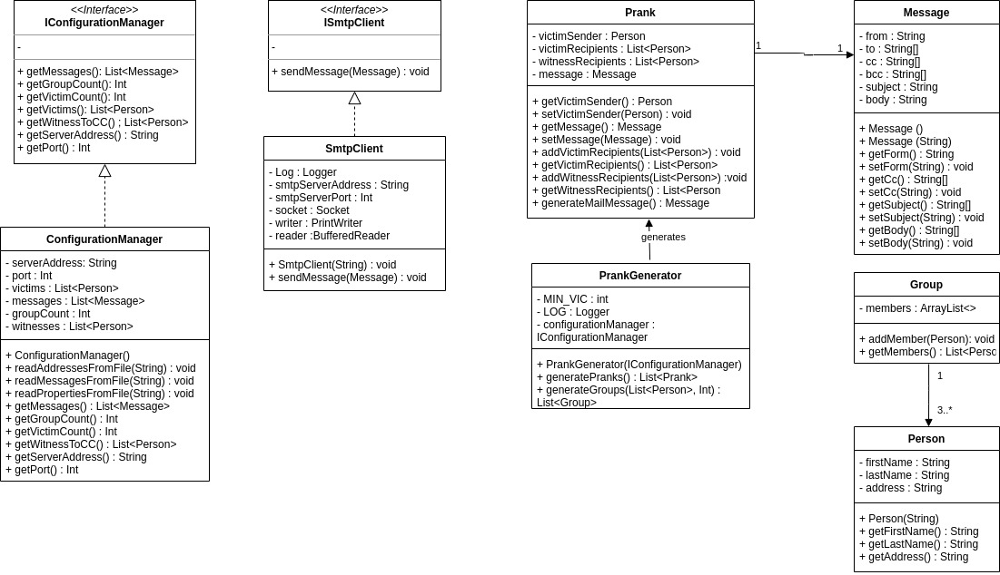

# RES - Lab SMTP

Author : Rhyan Robertson

## Introduction

This project is meant to practice programming a TCP Java application. It uses the Socket API to communicate with a SMTP server.

This application can send **prank** e-mails to a **group** of **victims**.

## Setup

### Config files

You can set the application parameters in the diffrent files of dir : MailRobot/config 

#### **config.properties** 

In this file, you can set the SMTP server address and port. The number of victims per group and the e-mail addresses of the witnesses to be CC.

```
smtpServerAddress=localhost
smtpServerPort=25000
numberOfGroups=3
witnessesToCC=rhyan.robertson@heig-vd.ch
witnessesToBcc=noreply@heig-vd.ch
```

#### **messages.utf8**

With this file, you can define pranks to send. The end of a prank is indicated by `==`.

```
Subject: Prank 1

Hi,

This is prank #1

Best regards
==
Subject: Prank 2

Hi,

This is prank #2

Best regards
==
Subject: Prank 3

Hi,

This is prank #3

Best regards
==
```

#### **victims.utf8**

This is the list of victims

```
one.1@heig-vd.ch
two.2@heig-vd.ch
three.3@heig-vd.ch
four.4@heig-vd.ch
five.5@heig-vd.ch
six.6@heig-vd.ch
seven.7@heig-vd.ch
eight.8@heig-vd.ch
nine.9@heig-vd.ch
```

## MockMock SMTP server

This project contains a MockMock SMTP server used for testing (avoid sending e-mails to real people).

I recommend using the Docker version in this repo. If Docker is already installed, you can simply run `build-image.sh` followed by `run-container.sh`

You can change the ports in `run-container.sh`. By default, the IP address is localhost (127.0.0.1) and the HTTP port is 8282. So you can access the web interface at http://localhost:8282/ .

## Implementation



`ConfigurationManager` reads the config files (properties, victims and messages)

` SmtpClient ` Connect to SMTP server and send e-mail

`PrankGenerator` Generates `Prank` s and `Group`s 


